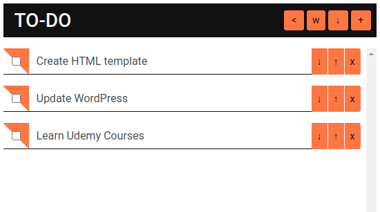
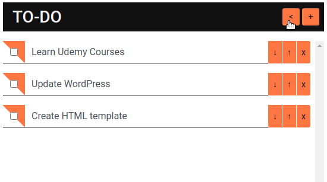
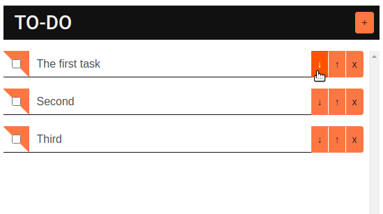

# Simple ToDo App with Additional Features

This small web application is a basic to-do list built using JavaScript and CSS. It includes several convenient features:

- Hotkeys: For quick addition, deletion, and editing of tasks.
- Sorting items: Allows you to organize tasks by priority or creation time.
- Weather forecast: A built-in widget displays the current weather in your region.
- Color scheme selection: Customize the look and feel of the app by choosing from multiple color schemes.

The app is perfect for those who appreciate minimalism and functionality at the same time.

## Color scheme selection

## Sorting

